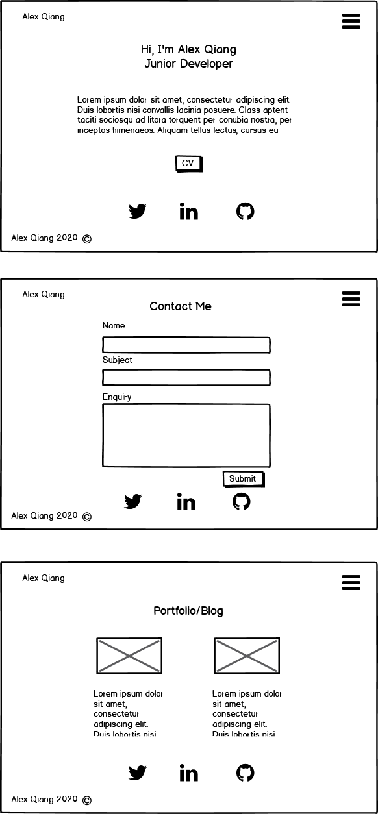

# Alex Qiang's Portfolio

https://alexqiang.netlify.app/

## Github repo
https://github.com/AlexQ6/Portfolio

## Purpose
The purpose of this portfolio is to showcase my abilities and experiences as a developers. This website includes my resume, important links and projects I have tackled as a developer. It highlights my proficiencies with programming languages, my experiences and personality.

## Target audience
The audience is to attract potential employers who are looking for a junior developer for their organisation. They are professionals with high expectations and are knowledgeable of programming practices and technologies.With in-depth knowledge of the technology industry, they are looking future employees with the know-how and soft skills to fit into their workplace.

## Functionality and Features

- Home page (index.html)
- About page (about.html)
- Resume (opens PDF in new window)
- Portfolio page (portfolio.html)
- Blog Posts page (blog.html)
- Contact Me page (contact.html)

## Sitemap

## Wireframes
### Mobile

### Desktop

## Screenshots

## Tech Stack
This portfolio website was built using the following:

 - HTML
 - CSS
 - Google Fonts
 - Visual studio code
 - Balsamiq (wireframes)
 - Lucidchart (sitemap)
 - netlify (deployment playform)

 ## Components
 - Responsive Navigation bar that turns into a hamburger menu in mobile
 - Footer with social media links and CV pdf link
 - Responsive contact form
 - Blog page